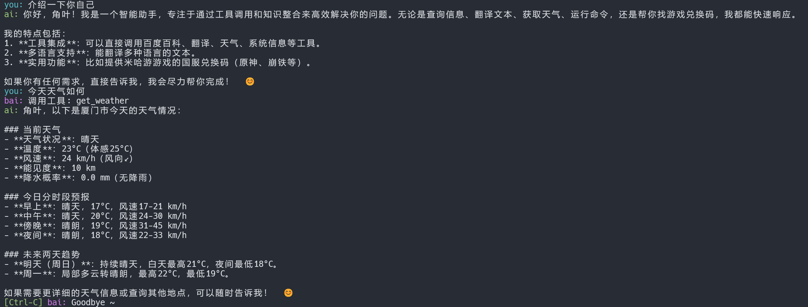

# bai

一个便携式 Bash 终端助手，支持多轮对话、流式处理、命令执行、工具调用等功能，灵感来自 [openai-terminal-assistant](https://github.com/worthable/openai-terminal-assistant)。


## 主要特性

- 支持 OpenAI API 多轮对话
- 流式输出与命令执行
- 丰富的会话指令与补全
- 进度指示（OSC94 协议）
- 兼容 Bash 5.2+ 新特性
- 依赖检查与可选扩展（fzf、bat、gum）

## 快速开始

1. **安装 bai**  
   在终端中执行命令：
   ```bash
   curl https://raw.githubusercontent.com/hornleaf/bai/refs/heads/main/bai | install -vm 755 /dev/stdin /usr/bin/bai
   ```

2. **准备环境变量**  
   需设置 `OPENAI_API_KEY` 和 `OPENAI_API_MODEL`，如：
   ```bash
   export OPENAI_API_KEY="你的API密钥"
   export OPENAI_API_MODEL="gpt-3.5-turbo"
   ```
   也可以设置 `OPENAI_BASE_URL` 自定义 API 端点，如：
   ```bash
   export OPENAI_BASE_URL="https://api.bailili.com/v1"
   ```

3. **以流式对话运行脚本**
   ```bash
   bai -n    # or --stream
   ```

4. **常用指令**
   - `.help` 查看所有指令帮助
   - `.exit` 退出会话
   - `.run <命令>` 执行 Shell 命令
   - `.eval <提示词>` 让模型生成命令
   - `.files <文件>` 上传文件


## 依赖项

- 必需：`bash` (推荐 5.3+)、`curl`、`jq`、`sed`、`cat`、`grep`、`file`
- 可选：`fzf`、`bat`、`gum`（增强体验）

## 环境兼容

建议在 Linux 下使用，MacOS/Windows（MSYS2）部分功能未完全测试。

## 进阶用法

- 从文件取得环境变量：`bai --config <文件>`
- 投喂 system prompt：`bai --sysfile <文件>`
- 让模型使用本地函数工具：`bai --callfile <文件>`

## 注意事项

- 本人技术有限，可能存在一些问题，欢迎提交 issue 或 PR
- 脚本仅支持 OpenAI 兼容的 API 服务
- 脚本仅供娱乐，请勿用于商业用途
- 如果喜欢这个项目，请投喂一个 Star ⭐️ 你的支持是我前进的动力

## 许可证

MIT License

---

如需更详细的用法和参数说明，请运行 `bai --help` 或查阅脚本内嵌注释。
