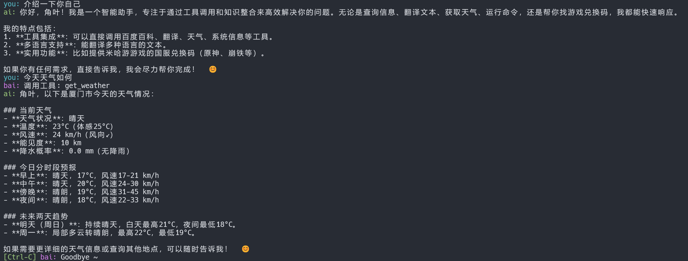

# bai

A portable Bash terminal assistant that supports multi-turn conversations, streaming processing, command execution, tool calls, and more, inspired by [openai-terminal-assistant](https://github.com/worthable/openai-terminal-assistant).


## Main Features

- Support for OpenAI API multi-turn conversations
- Streaming output and command execution
- Rich session commands and completions
- Progress indication (OSC94 protocol)
- Requires Bash 5.3+ new features
- Dependency checks and optional extensions (fzf, bat, gum)

## Quick Start

1. **Install bai**  
   Run the command in the terminal:
   ```bash
   curl https://raw.githubusercontent.com/hornleaf/bai/refs/heads/main/bai | install -vm 755 /dev/stdin /usr/bin/bai
   ```

2. **Prepare environment variables**  
   Set `OPENAI_API_KEY` and `OPENAI_API_MODEL`, e.g.:
   ```bash
   export OPENAI_API_KEY="your API key"
   export OPENAI_API_MODEL="gpt-3.5-turbo"
   ```
   You can also set `OPENAI_BASE_URL` to customize the API endpoint, e.g.:
   ```bash
   export OPENAI_BASE_URL="https://api.bailili.com/v1"
   ```

3. **Run the script in streaming conversation mode**
   ```bash
   bai -n    # or --stream
   ```

4. **Common commands**
   - `.help` View all command help
   - `.exit` Exit session
   - `.run <command>` Execute Shell command
   - `.eval <prompt>` Let the model generate command
   - `.files <file>` Upload file

## Dependencies

- Required: `bash` (recommended 5.3+), `curl`, `jq`, `sed`, `cat`, `grep`, `file`
- Optional (enhanced experience): `fzf`, `bat`, `gum`, `fastfetch`, `catimg`

# Language

Built-in Simplified Chinese `zh_CN` (not overwritable), new localization languages can be imported from files:
   ```bash
   # Import using command line arguments
   bai --add-l10n-file=file1,file2,file3...

   # Import using environment variables
   export BAI_L10N_FILES=file1,file2,file3...
   ```
File format can refer to the existing [English-US](./locate/en_US.txt) language file

## Environment Compatibility

Recommended for use on Linux, MacOS/Windows (MSYS2) some features not fully tested.

## Advanced Usage

- Get environment variables from file: `bai --config <file>`
- Feed system prompt: `bai --sysfile <file>`
- Let the model use local function tools: `bai --callfile <file>`

## Notes

- Limited technical skills, there may be some issues, welcome to submit issue or PR
- Script only supports OpenAI compatible API services
- Script for entertainment only, do not use for commercial purposes
- If you like this project, please give a Star ⭐️ your support is my motivation

## License

MIT License

---

For more detailed usage and parameter descriptions, run `bai --help` or check the embedded comments in the script.